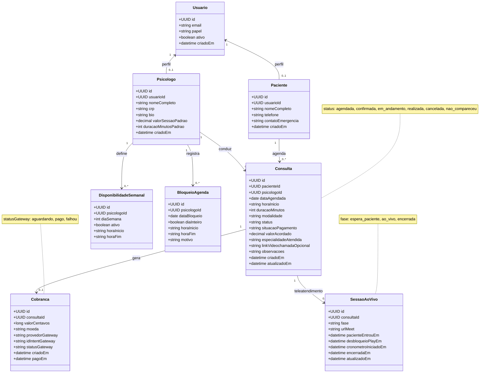

# Diagrama de classes — Clínica Harmonia (ERP / persistência)

Modelo lógico em português para derivar tabelas, chaves estrangeiras e APIs. O front atual usa mocks em TypeScript (`MockAppointment`, `SharedLiveSessionState`, etc.); este diagrama representa o **alvo** no banco de dados.

**Arquivo fonte (só Mermaid):** [`diagrama-classes-banco-dados.mmd`](./diagrama-classes-banco-dados.mmd)

## Diagrama principal

## Mapeamento rápido (demo → modelo)

| Mock / front | Classe alvo |
|--------------|-------------|
| `MockAppointment` | `Consulta` |
| `MockPaymentCharge` | `Cobranca` |
| `SharedLiveSessionState` | `SessaoAoVivo` (+ `Consulta`) |
| `PsychologistAgendaAppointment` | `Consulta` (origem agenda) ou visão unificada |

## Diagrama da camada demo (TypeScript)

Detalhe dos tipos atuais no repositório: [`modelagem-classes.mmd`](./modelagem-classes.mmd).
